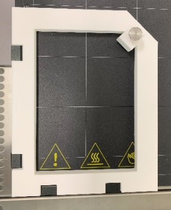
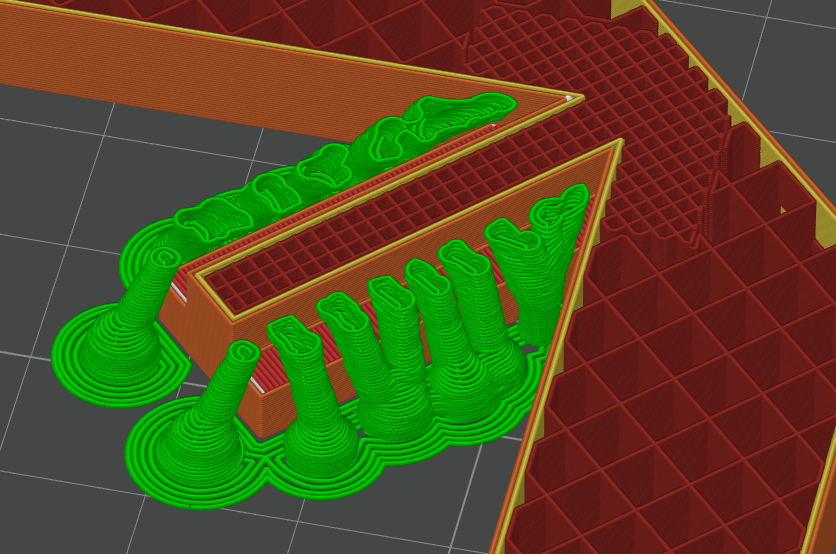
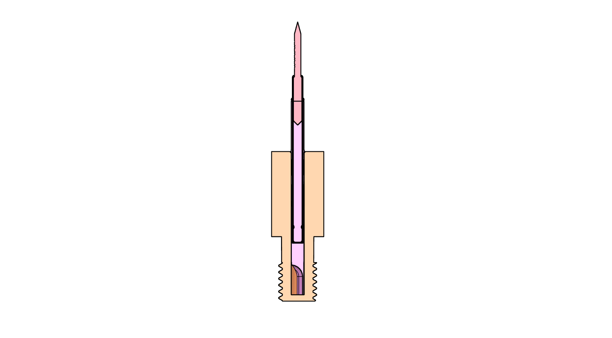
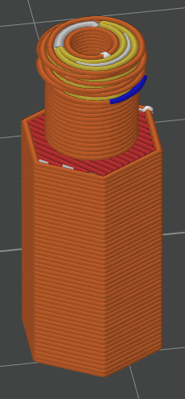
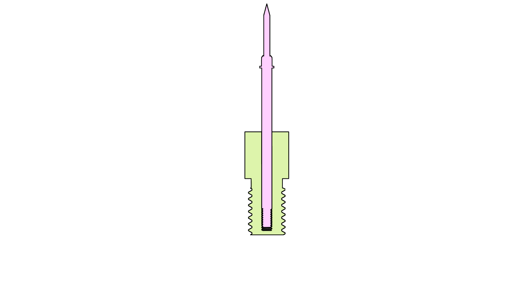
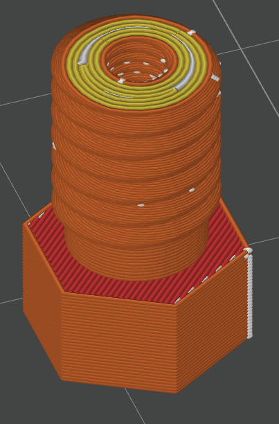
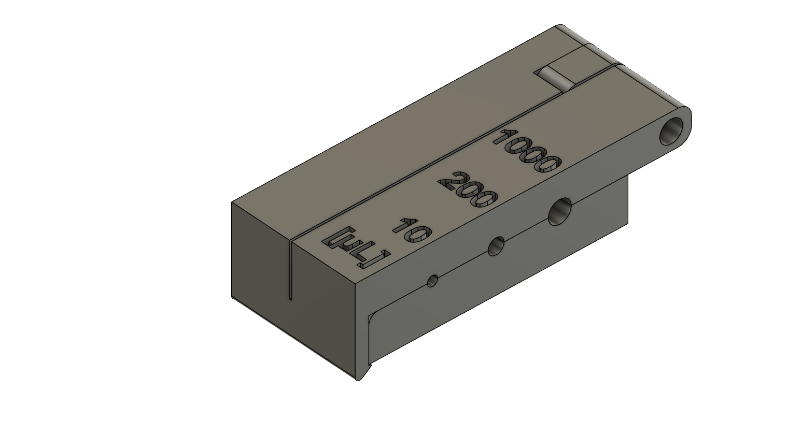
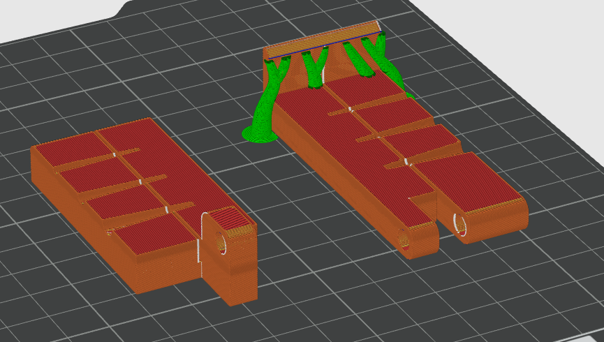
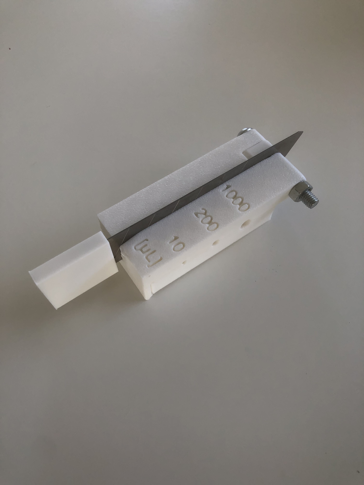

# CAD files

In this section we want to go into detail on how to print and assemble the needed parts mentioned in the BOM file.

## frame

The frame is supposed to hold the well plate on the print bed while maintaining a fixed position consistently. The frame itself is attached with four clamps designed for glass print beds. For the frame you need in total four pieces, of which are two 3D-printed. Both of these parts are included in the file "frame".
In general there are two things which have to be considered when printing the frame. Since the frame features some floating areas you want to enable some kind of support, preferably tree support for printing. Moreover it is preferred to add some kind of modifier in the area of the slider to increase the infill density since this section of the frame is under more mechanical stress.

As you can see tree support was used while achieving a higher infill density in the slider area. The frame itself was printed with an infill density of 15% while the area of the slider has an infill density of 70%. Every part was printed with a 0.4mm nozzle and a layer height of 0.2mm using white PLA on the BambuLab A1 mini.

Since the screw for securing the slider on the frame has to be screwed in and out a few times we decided to use an M3 threaded insert for the slider. This ensures a tight fit of the screw even after several iterations of use. Last but not least you need an M3 knurled knob for the slider.
These two parts are more or less optional since you could also think of just using a normal M3 screw without threaded insert.

print settings:
- infill density: 15%-70%
- nozzle diameter: 0.4mm
- layer height: 0.2mm
- material: PLA

## M6 adapter

The M6 adapter is needed to mount the spring loaded test probe to the printhead of the printer. As mentioned in the preprint this option is preferred over using the mounting block together with the drill chuck. The adapters are quite similar, but in this section, we will go into detail on how to print them. The following test probes are currently supported:

| test probe (just an example)  | print file | suitable pipette |
| ------------- |:-------------:| -----:|
| GKS-912 201 060 R 1504 | adapter_M6_2_15mm.step | 10μL  |
| GKS-112 201 080 R 1504 | adapter_M6_2_15mm.step | 200μL |
| GKS-112 201 100 A 1504 | adapter_M6_2_15mm.step | 200μL |
| GKS-112 201 080 R 1502 M | adapter_M6_M1_6.step | 200μL |
| GKS-112 201 100 R 1502 M | adapter_M6_M1_6.step | 200μL |
| GKS-503 201 180 R 1502 M | adapter_M6_M2_5.step | 1000μL |

### M6 adapter without thread

This adapter is used with the non threaded test probes and is designed to be used with a receptacle. It could also be used without receptacle but you might have to play around a little bit with X-Y hole compensation in the slicer settings to get a good press fit.
To increase first layer adhesion the M6 thread points upwards while printing. Once again you may have to adjust the hole compensation in the slicer to get a good fit of the receptacle. Note that the width of the M6 thread can also be adjusted in the slicer if the fit is too loose or too stiff. More information on this topic can be found [here](https://wiki.bambulab.com/en/software/bambu-studio/xy-hole-contour-compensation). Since the most complex shape in this print is the M6 thread you might also want to decrease the layer height for this section. While prototyping we used an adaptive layer height profile to avoid a further increase in total printing time. You can find more on the topic [here](https://wiki.bambulab.com/en/software/bambu-studio/adaptive-layer-height).

  

print settings:
- infill density: 40%
- nozzle diameter: 0.2mm
- layer height: 0.04mm
- material: PLA

### M6 adapter with thread

This adapter is used with the threaded test probes, mostly recognizable by the M in the name. In general the topics mentioned above have to be considered with this adapter too since they are very simillar. In our case the printed thread was a little bit too small, so we had to adjust the X-Y hole compensation which solved this issue.  One major difference is the nozzle used. Since the thread of the test probe is very small (in our case M1.6 and M2.5) we used a 0.2mm nozzle with a layer height of 0.04mm in the section of the thread. The initial layer height was 0.08mm to avoid first layer issues. 

  

print settings:
- infill density: 40%
- nozzle diameter: 0.2mm
- layer height: 0.04mm
- material: PLA

## cutting device

The cutting device is used to trim pipettes to a suitable length and consists of six parts, three of which are 3D-printed. A standard cutter knife blade—commonly available at most hardware stores—is used for the actual cutting process. An M5 screw and nut are used to hold the assembly together. (See pictures below.)
An adaptive layer height profile was used once again to achieve greater detail in the areas of the moulds that hold the pipettes. For the part of the print that snaps onto the other component, support structures were used during printing.

  

print settings:
- infill density: 20%
- nozzle diameter: 0.2mm
- layer height: 0.2mm
- material: PLA

  

