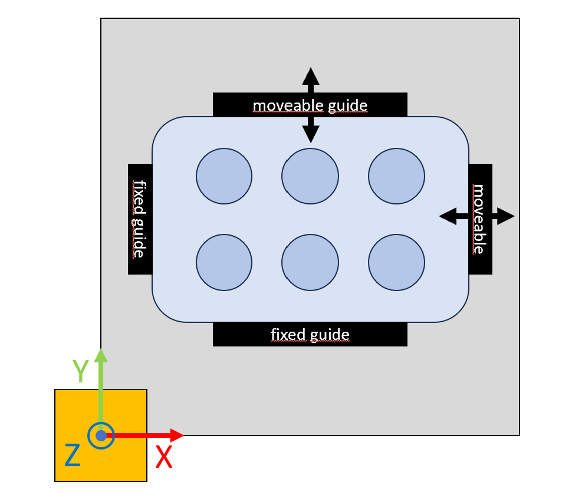
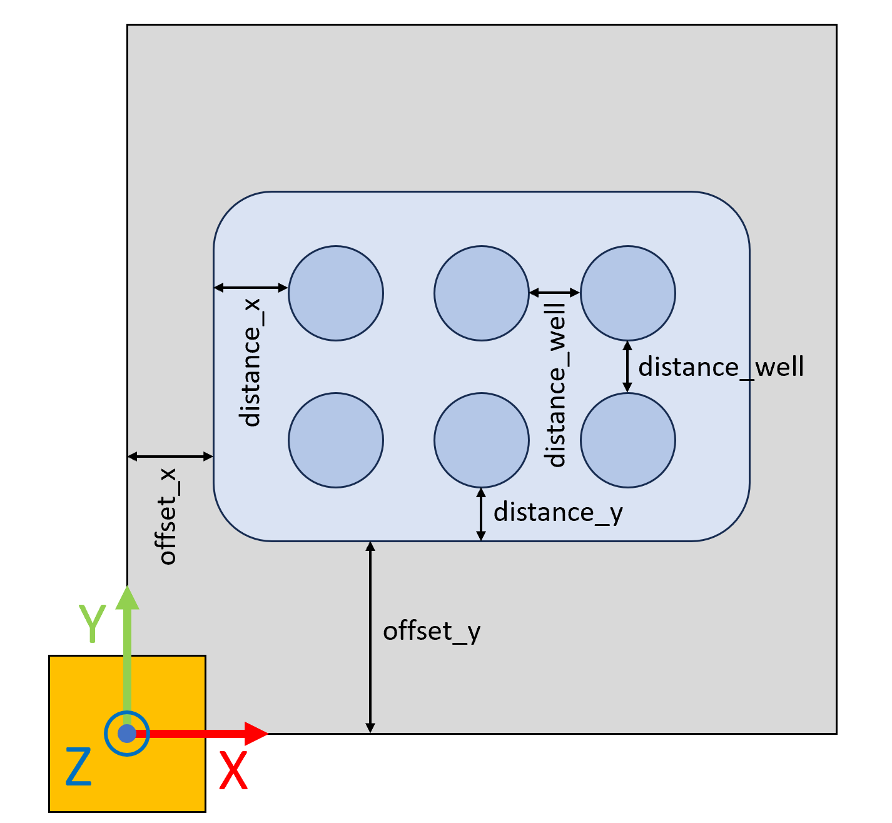
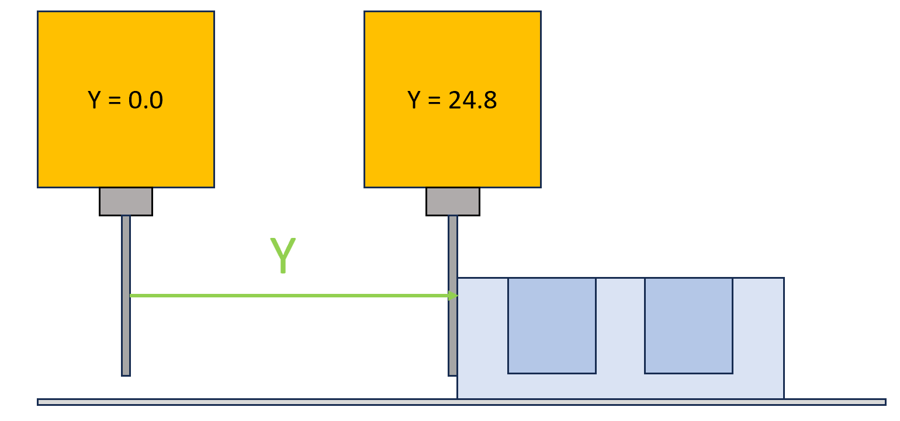
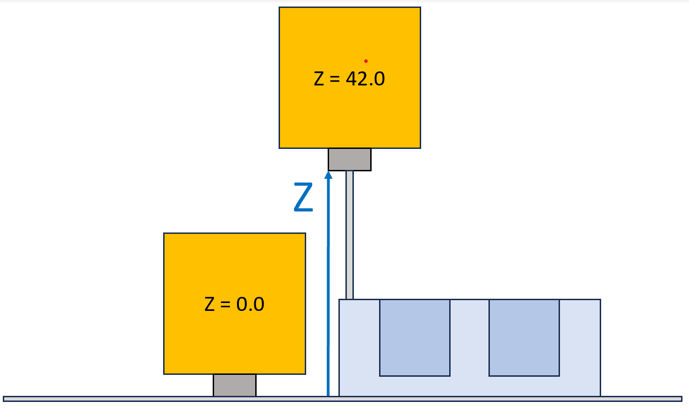
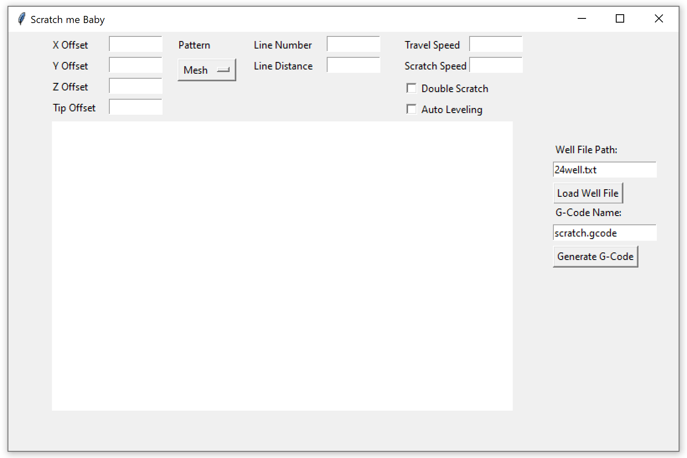
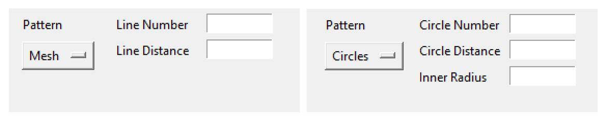

# Scratch me Baby

An approach to automating Scratch Essays with 3D Printers and Custom G-Code.

## What is a scratch essay?

Divide cells and study regrowth

## Why do we need to automate it?

- repeatable
- manual labor sucks, otherwise done by hand, not accurate
- cheap (current alternativve machine expensive)

## What can be done with this repository?
- scratch custom well plates
- use one of 2 scratch patterns: mesh (one or multiple lines), circles (one or multiple circles)

## How to use this repository
Here we will discuss how to use this repository for your scratch essay and what you need

### Bill of Materials
- 3D-Printer (preferrably with autoleveling sensor)
- Luer Lock adapter with M6 thread
- tip for Luer Lock adapter
- 7mm wrench

### Preparation
In this chapter all necessary steps to prepare the printer are discussed.

#### Remove the nozzle
The first step is to remove the nozzle of the old printer with a 7mm wrench. Afterwards screw in the Luer Lock adapter that will be used to hold the tips.

#### Level the printbed (Not needed with autoleveling)
To level the printbed first home the printer. Then disable the motors so you can freely slide the printhead in the XY-plane.
Now slide a sheet of paper between your adapter in the printhead and and your printbed. Visit every corner respectively and tighten/release the screws until you feel a bit of resistance.
The amount of resistance should be the same for each corner. You can also level the bed by eye so that the distance between the adapter and the printbed is the same for each corner.
The actual distance between insert and bed is not important it just has to be consistant.

#### Autolevel the printbed
If you want to use autoleveling, you first have to delete any old mesh and create a new one for your printbed and save it. You should find the necessary actions somewhere in the printer settings.

#### Mount the positioning for your wells
The next step is to mount your positioning guide for the well on the buildplate. It is important that the sides of your guide/well align with the X- and Y-axis. A magnetic printbed is not recommended as it can slip and loose the position.
If you scratch wells with different sizes it is recommendet to have permanent position guides in the lowest XY-corner and variable guides for the other sides, see picture below.

This way you only have to get the x_offset and y_offset once. The offsets are shown in the picture below.

#### Measure offsets
To measure the offsets you have to home your printer and put the well on the buildplate. Then use the "move" function of your printer to bring the z-axis high enough that you can insert a tip.
Using the "move" function the printer will always display the current position of the axis you are moving. This value is the offset we need.
First you have to move the tip to the X and Y edges closest to the home position respectively so that the tip barely touches them. For Y the printhead was moved to 24.8mm in the example picture below.

To get your offset values for X and Y you still have to add the radius of the tip you used. For example it has a diameter of 0.4mm: offset_y = Y + d/2 = 24.8mm + 0.2mm = 25.0mm

For the Z offset just move the printhead until the tip touches the well, see picture:

The Z value can directly be used as the offset. When using a different tip you have to adjust the Z offset again. It is possible to just measure the difference in length of the tips and adjust the offset accordingly.

### Skript usage
After measuring all required offsets and distances you are ready to use the skript. If you have python installed and added to your PATH variables during installation you can just double click the GUI.py

If not, you have to enter one of the three commands in a powershell window with the same folder:

~~~python
py ./GUI.py
python ./GUI.py
python3 ./GUI.py
~~~

The GUI will look like this: 

#### Enter offsets
In the top left of the GUI you have to enter your measured offsets in mm. The tip offset determines the minimal distance between the center of the tip and the well wall. It HAS to be at least half of the tip diameter. For more robust scratching you might even increase it to 1-2 mm.

#### Choose pattern
Right next to the offsets you can choose between between the patterns: mesh (mutiple lines) and circles.

The mesh requires only the number of lines and the distance between the lines. The circles also need the radius of the inner most circle.

#### Movement settings
Next to the patterns you can enter the movement speed of the printhead during moving and scratching in mm/s. Be aware that there are limitations to these speeds in the printer settings, mainly noticeable for the z-speed. There is also a tickbox for double scratching each line/circle. Autoleveling also has to be enabled with a tickbox here.

#### Cleaning
If you want to clean the tip before/after scratching a well plate, you can place one or more cleaning containers and specify their coordinates in a "clean.txt" file. An example of the file content is provided below. The cleaning will draw circles with "Number" amount of cirlces, "Depth" and "Radius" inside the cleaning container. The depth is relative to the "Z" coordinate. The "/" marks the end of the data for one container. You can add as many of these sections as you like.
~~~bash
X: 150
Y: 120
Z: 30
Radius: 4
Depth: 10
Number: 20
/
~~~
When the "Pause Before Clean" checkbox is ticked the tip will wait 1 cm over the specified XYZ coordinates. This makes it easy to position your cleaning container without exactly measuring the coordinates.

#### Load well setting
On the right side of the GUI you have to provide the well data. As the wells are mostly standardized we are reading the well data from a *.txt file, as it is easy to share, modify and reuse. An example of such a file is included in the repository as "24well.txt".

#### Select wells to scratch
After loading the well file, the layout should be plotted in the central area of the GUI. By clicking a well it turns red and will be excluded from scratching. The well in the bottom left corner represents the well closest to the coordinate origin, wich is the home position of your printer. It is usually the bottom left corner of the printbed as well

#### Generate G-Code
The final step is to enter the name of your *.gcode file and to generate the G-Code. BEFORE running it on the 3D-Printer be sure to read the next chapter.

### Running the G-Code
Before running the G-Code on your machine be sure to have the bed leveled or correctly prepared for the autoleveling option. The guides and the well should be in place by now. Also remove the scratching tip, as the printer has to be homed before scratching. Otherwise it would drive the tip into the print bed. After starting the print the "M00" G-Code command will stop the printer before scratching to insert the tip. After inserting the tip just continue the print, usually by pressing the knob.

After scratching the remove the tip again and end the print.
