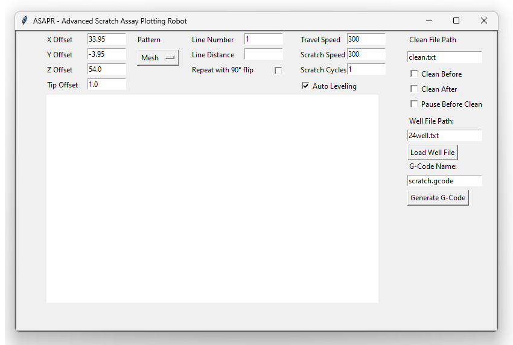

# ASAPR - Advanced Scratch Assay Plotting Robot

This repository contains the code to execute in vitro cell analysis via scratch assays as done in the preprint "The use of 3D-printers as plotters opens up a new world in performing 2D migration analyses". We greatly appreciate any feedback, contributions, or other input and questions you may have!

## How to use this repository

Here we will discuss how to use this repository for your scratch essay and what you need.

### Bill of Materials

- 3D-Printer that supports M0 command (preferrably with autoleveling sensor)
- Frame to hold your well plate
- 7mm wrench
- Adapter from M6 thread to tip
- Spring loaded pipette tip

These are the general materials you will need. The specific components used in the preprint are detailed in the BOM.xlsx file.

### Preparation of Printer

This chapter covers all the essential steps to prepare the printer. If you don't have access to a second printer for printing the frame, it's recommended to use the printer intended for scratching to print it. Be aware that whenever you home the printer, the tip should be removed to avoid it being driven into the build plate, which could cause damage!

#### Replace the nozzle

The first step is to remove the nozzle of the old printer with a 7mm wrench. Afterwards screw in the adapter with M6 thread that will be used to hold the tips.

#### Level the printbed (Not needed with autoleveling)

To level the print bed, start by homing the printer, then disable the motors to allow free movement of the printhead in the XY-plane. Slide a sheet of paper between the adapter in the printhead and the print bed. Visit each corner and adjust the screws by tightening or loosening them until you feel slight resistance when moving the paper. Ensure the resistance is consistent across all corners. Alternatively, you can level the bed visually, making sure the distance between the adapter and the print bed is uniform at each corner. The exact distance isn't crucial, as the Z-offset will be set later.

#### Autolevel the printbed

If you want to use auto-leveling, you must first delete any old mesh, then create and save a new one for your print bed. The necessary actions can be found in the printer settings. For detailed guidance, there are many online tutorials available that explain this process step by step.

#### Mount the positioning for your wells

The next step is to mount your positioning guide for the well on the build plate. It's important to ensure the sides of the guide or well align with the X and Y axes. A magnetic print bed is not recommended, as it may slip and lose its position. If you're working with wells of different sizes, it's recommended to use permanent position guides in the lowest XY corner and variable guides for the other sides (see the picture below).

This setup allows you to determine the x_offset and y_offset only once. The offsets are shown in the picture below.

The positioning guide used in the preprint can also be found in this repository. It can be printed using the same printer that will be used for scratching.

#### Measure offsets

There are two approaches to determining the offsets. The first method uses the printer's built-in "move" function and can be applied to any printer. The second method involves manually measuring the offset from the coordinate origin.

##### Using the printer

To measure the offsets, start by homing your printer and placing the well on the build plate. Use the printer's "move" function to raise the Z-axis high enough to insert a tip. As you move the axes, the printer will display the current position, which is the offset you need.

First, move the tip to the X and Y edges closest to the home position, ensuring it barely touches the edges. For instance, in the example image, the printhead was moved to 24.8mm for the Y-axis:

To calculate the offset for X and Y, add the radius of the tip used. For example, if the tip diameter is 0.4mm, the offset for Y would be: offset_y = Y + d/2 = 24.8mm + 0.2mm = 25.0mm

For the Z offset, move the printhead until the tip touches the well, as shown:

The Z value displayed can be used directly as the offset. If you change the tip, you'll need to adjust the Z offset by either remeasuring or calculating the difference in length between the tips and adjusting accordingly.

##### Calculating from coordinate system

This approach can be used if the printer's coordinate origin is marked on the build plate. You can simply measure the distance between the well plate and the origin in the X and Y dimensions using a caliper gauge. However, the Z offset still needs to be determined using the method described above, by moving the printer until the tip touches the well.

#### Prepare well file

The program reads well dimensions from a file, which you will need to input manually based on your well. These specifications can typically be found in the product's technical documentation or you can measure them yourself. An example file for a four by six well plate is provided in the repository. It contains the following dimensions:

~~~bash
number_x: 3
number_y: 2
diameter: 15.5
depth: 17.3
distance_well: 3.5
distance_x: 7.8
distance_y: 6.0
~~~

The values for number_x and number_y represent the number of wells along the x and y axes, respectively. Be aware that they depent on the orientation of your well. The remaining dimensions are displayed in the image below.

### Preparation of your PC

You will need an installation of python version 3 or newer. When installing check the box that says "Add Python to PATH". Afterwards open a command window like powershell or cmd and enter the following commands sequentially:

~~~bash
python -m ensurepip --upgrade
pip install svgpathtools
~~~

This will install the python package manager and the package svgpathtools which is needed to process vector graphics.

### Script usage

After measuring all the required offsets and preparing your PC, you’re ready to use the script. If Python is installed correctly, you can simply double-click ASAPR.py to run it.

The GUI will appear as shown below:

#### Enter offsets

In the top left of the GUI, you need to enter your measured offsets in millimeters. The tip offset specifies the minimum distance between the center of the tip and the well wall. This value MUST be at least half of the tip diameter. For more robust scratching, you might consider increasing this offset to 1-2 mm.

#### Choose pattern

Next to the offsets you can choose between between three different patterns: mesh (mutiple lines), circles and svg grapics.

##### Mesh

The mesh pattern is defined by the number of lines and the distance between them. You can also just choose to scratch a single line through the center of the well. If the "Repeat with 90° flip" box is checked, the mesh will be scratched again rotated by 90° to create a criss-cross pattern.

##### Circles

The circles pattern is defined by the number of circles, the distance between them, and the diameter of the innermost circle.

##### SVG

To scratch a vector graphic, place the file in the same folder as ASAPR.py and enter its name. The SVG should contain only lines and curves, as full area scratching is not supported yet. The scratch will follow the lines like a trajectory, so you can create larger surfaces by placing lines close to each other. The SVG will be scaled automatically to the maximum size that fits within the well. If you want it to be smaller, you can adjust the scale parameter to values between 1 (maximum size) and 0 (essentially a point).

#### Movement settings

Next to the patterns, you can set the movement speed of the printhead during both movement and scratching, in mm/s. Note that there are limitations to these speeds in the printer settings, especially for the Z-axis speed. If you want to scratch your pattern multiple times, you can increase the "Scratch Cycles" value from 1 to however many cycles you desire. To enable the auto-leveling function of your printer, check the corresponding tickbox.

#### Cleaning

To clean the tip before or after scratching a well plate, you can set up one or more cleaning containers and specify their coordinates in a "clean.txt" file. The cleaning process involves moving the tip in a specified number of circles within each container. Below is an example of the file content format:

~~~bash
X: 150
Y: 120
Z: 30
Radius: 4
Depth: 10
Number: 20
/
~~~

In this file, each section describes a cleaning container, with Number specifying the amount of circles, Depth indicating how deep the circles will be relative to the specified Z coordinate, and Radius defining the size of the circles. The "/" marks the end of the data for one container, and you can add as many sections as needed in one file.

When the "Pause Before Clean" checkbox is ticked, the tip will pause 1 cm above the specified XYZ coordinates. This allows you to position your cleaning container more easily without needing to measure the coordinates precisely.

#### Load well setting

On the right side of the GUI, you'll need to provide the well data. Since wells are often standardized, the data is read from a *.txt file for ease of sharing, modification, and reuse. An example file named "24well.txt" is included in the repository.

#### Select wells to scratch

After loading the well file, the layout will be plotted in the central area of the GUI. Clicking on a well will turn it red, indicating that it will be excluded from scratching. You can also click and drag your mouse to select or deselect multiple wells underneath. The well located in the bottom left corner represents the one closest to the coordinate origin, which is typically the home position of your printer and usually corresponds to the bottom left corner of the print bed.

#### Generate G-Code

The final step is to enter the name of your *.gcode file and to generate the G-Code. BEFORE running it on the 3D-Printer be sure to read the next chapter for important instructions. In the future there might be the option to send the generated G-Code right from the GUI over W-Lan, until then you need to save the G-Code on a SD-Card and plug into the 3d-printer.

### Running the G-Code

Before running the G-Code on your machine, ensure that the bed is leveled or properly prepared for the auto-leveling option. The guides and well should be correctly positioned by now. Additionally, remove the scratching tip, as the printer will home before starting the scratching process; leaving the tip in place could cause it to be driven into the print bed.

Once you start the print, the "M0" G-Code command will pause the printer before scratching, allowing you to insert the tip. Verify that your printer firmware supports this command. After inserting the tip, continue the print, usually by pressing the knob.

You can preview how your scratches will look by pasting your G-Code into a viewer. One option is ncviewer.com, though keep in mind that for larger X and Y coordinates, the depiction might be shifted. Despite this, the G-Code will still function correctly on your printer.
